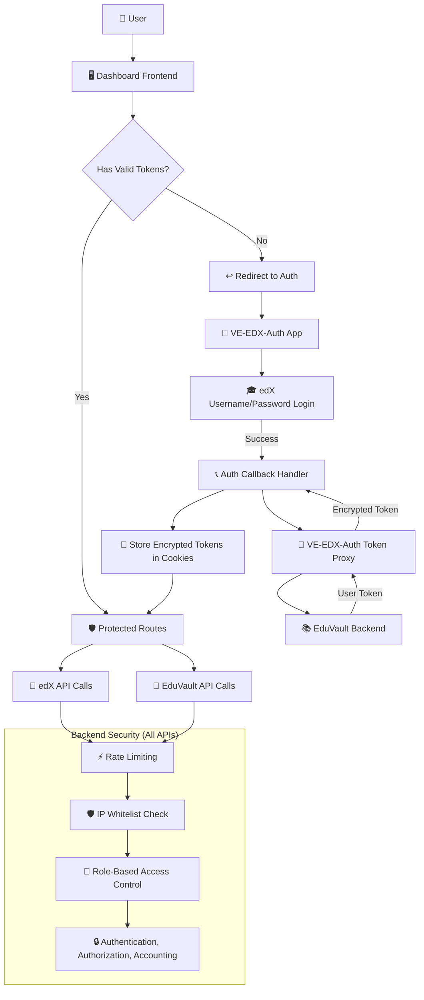
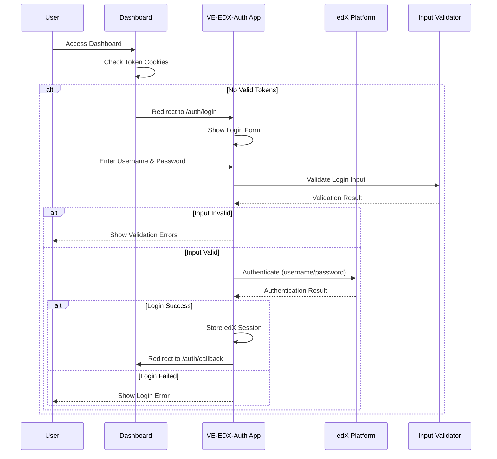
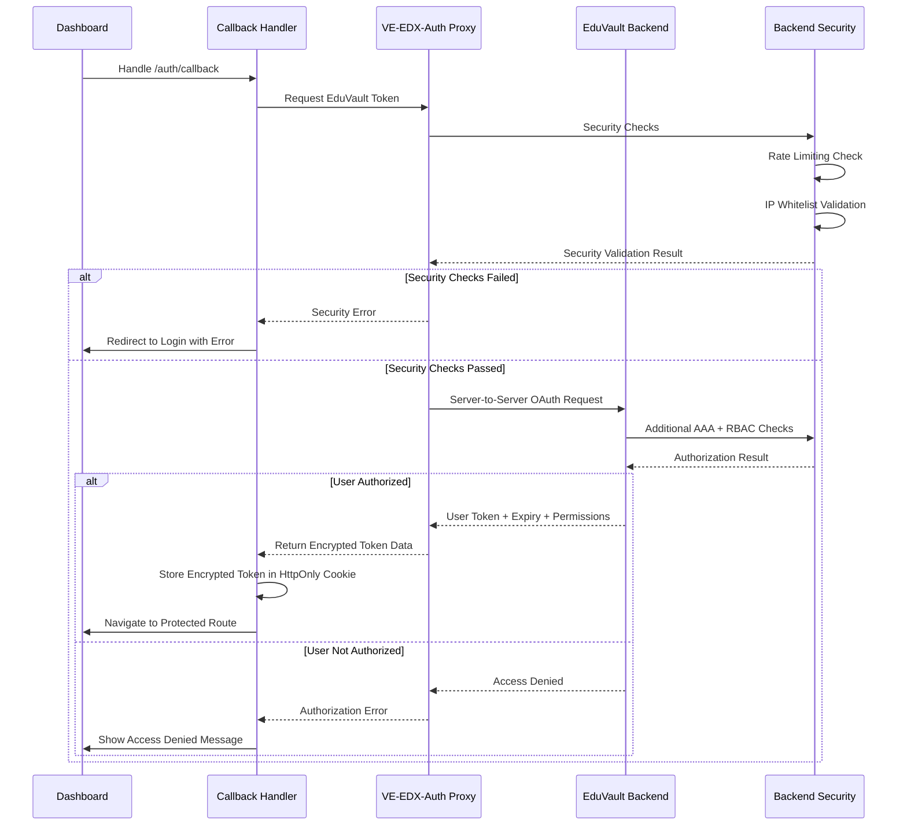
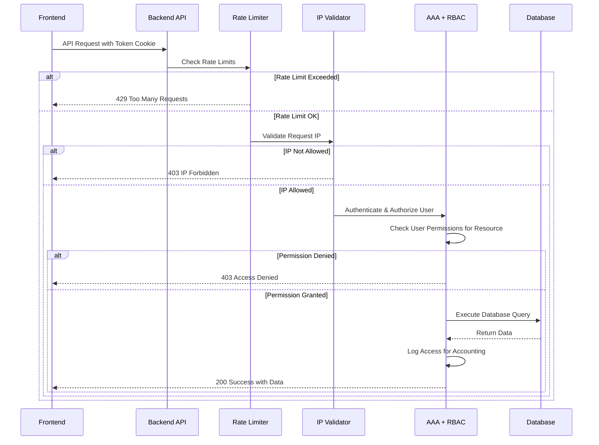

# VE-EDX-Auth

An Open edX Django app that provides a proxy endpoint to get user access tokens from Edu Vault backend using Open edX's built-in OAuth infrastructure.

## Description

This app enables secure token exchange by leveraging Open edX's existing OAuth system to authenticate with Edu Vault and retrieve user-specific access tokens. It acts as a proxy between your frontend applications and the Edu Vault authentication API.

## Features

- **OAuth Integration**: Uses Open edX's built-in OAuth2 provider for secure authentication
- **Token Proxy**: Provides a clean API endpoint to get user tokens from Edu Vault
- **Type Safety**: Full type hints and comprehensive error handling
- **Logging**: Structured logging for monitoring and debugging
- **Simple Setup**: Minimal configuration required

## Multi-Service Authentication Architecture

This app is part of a larger multi-service authentication system that integrates:
- **VE-EDX-Auth**: This Django app (token proxy)
- **edX Platform**: Provides user authentication via username/password
- **Dashboard Frontend**: Main application interface
- **EduVault Backend**: Educational content and user data API

## System Architecture



## Authentication Flow

### 1. Initial User Login

When a user needs to authenticate:



### 2. Token Exchange Process

After successful edX authentication, the token proxy handles secure token exchange:



## Security Implementation

### Backend Security (Django Settings)

All security checks happen at the Django backend level when API calls are made:

```python
# settings.py - Security Configuration
ALLOWED_HOSTS = ["localhost", "127.0.0.1", ".virtueducate.com"]

# Rate Limiting (applied to all API endpoints)
RATELIMIT_ENABLE = True
RATELIMIT_USE_CACHE = 'default'

# Secure Cookies
SECURE_COOKIE_HTTPONLY = True
SECURE_COOKIE_SECURE = True
SESSION_COOKIE_SAMESITE = 'Strict'
CSRF_COOKIE_SAMESITE = 'Strict'

etc
```

### 1. Rate Limiting

Applied automatically to all backend API endpoints:

```python
# Applied to VE-EDX-Auth endpoints
@ratelimit(key='ip', rate='10/m', method='POST', block=True)
def token_proxy_view(request):
    """Rate limited token proxy endpoint"""
    pass

# Applied to EduVault API endpoints  
@ratelimit(key='user', rate='100/h', method='GET', block=True)
def get_user_data(request):
    """Rate limited data access"""
    pass

# Applied to edX API endpoints
@ratelimit(key='ip', rate='50/m', method='ALL', block=True)
def edx_api_endpoint(request):
    """Rate limited edX API access"""
    pass
```

### 2. IP Whitelisting

Handled at Django application level via `ALLOWED_HOSTS`:

```python
# Only requests from these domains/IPs are accepted
ALLOWED_HOSTS = [
    "localhost",           # Development
    "127.0.0.1",          # Local testing  
    ".virtueducate.com"   # Production domain and subdomains
]


```


## Token Storage and Management

### Encrypted Cookie Storage

Frontend stores tokens securely using encrypted HTTP-only cookies:

```typescript
// Frontend encrypted cookie management
class SecureTokenManager {
    private readonly ENCRYPTION_KEY = process.env.REACT_APP_TOKEN_KEY!
    
    storeToken(token: string, expiry: Date): void {
        // Encrypt token before storage
        const encrypted = CryptoJS.AES.encrypt(token, this.ENCRYPTION_KEY).toString()
        
        // Store in secure HTTP-only cookie
        document.cookie = [
            `auth_token=${encrypted}`,
            `expires=${expiry.toUTCString()}`,
            'HttpOnly',
            'Secure', 
            'SameSite=Strict',
            'Path=/'
        ].join('; ')
    }
    
    getToken(): string | null {
        const encrypted = this.getCookieValue('auth_token')
        if (!encrypted) return null
        
        try {
            const decrypted = CryptoJS.AES.decrypt(encrypted, this.ENCRYPTION_KEY)
            return decrypted.toString(CryptoJS.enc.Utf8)
        } catch {
            this.clearToken()
            return null
        }
    }
    
    private getCookieValue(name: string): string | null {
        const value = `; ${document.cookie}`
        const parts = value.split(`; ${name}=`)
        return parts.length === 2 ? parts.pop()?.split(';').shift() || null : null
    }
}
```

## API Call Security Flow

Every API call goes through comprehensive backend security validation:



## Installation and Setup

### 1. Install VE-EDX-Auth App

```bash
# Clone the repository
git clone https://github.com/your-org/VE-EDX-Auth.git

# Install in your edX installation
pip install -e ./VE-EDX-Auth
```

### 2. Add to edX Configuration

```python

# Configure EduVault backend URL
EDUVAULT_API_URL = 'https://vault.virtueducate.com/api'
```


## Security Features Summary

### ✅ **Implemented Security Measures**

1. **Rate Limiting**: All API endpoints protected against abuse
2. **IP Whitelisting**: Request filtering at Django `ALLOWED_HOSTS` level  
3. **Encrypted Token Storage**: AES-encrypted HTTP-only cookies
4. **Input Validation**: Comprehensive validation for login credentials
5. **AAA + RBAC**: Authentication, Authorization, Accounting with role-based permissions
6. **Server-Side Security**: All security checks happen in backend, no frontend bypass possible

### 🔒 **Security Architecture Benefits**

- **Defense in Depth**: Multiple security layers prevent single point of failure
- **Zero Frontend Trust**: All security validation occurs server-side
- **Comprehensive Logging**: Full audit trail for compliance and monitoring
- **Token Security**: Encrypted storage prevents XSS-based token theft
- **Access Control**: Fine-grained permissions for resource access


